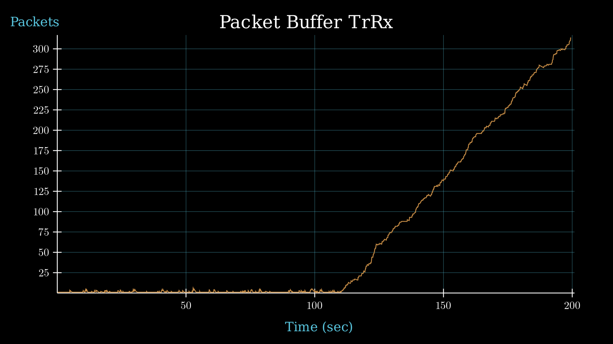

### Informe Laboratorio 4


# Analisis de protocolos de control de congestion y flujo de la capa de Transporte, en diferentes casos con Simulacion discreta en OMNeT++

- Laboratorio desarrollado por el _Grupo 46_, conformado por:
  - ___Mensio Valentino___  
  - ___Longhi Fabrizio___ 
  - ___Espinosa Bruno___

## Resumen

A continuacion, trabajaremos sobre los problemas de congestion y de flujo que puede haber dentro del trafico de una red, para esto analizaremos distintas simulaciones hechas con la herramienta OMNeT++, con algunas caracteristicas, como tasas de datos acotadas y tamaño de buffers limitados. Y como nuestra implementacion se basa en un nodo generador que envia paquetes a otro nodo receptor por medio de una red, puede llegar a resolver dichos inconvenientes haciendo que tanto la perdida de paquetes como el tiempo de retraso de entrega de un paquete sea menor o nula.

## Introduccion

El Open Systems Interconnection Model, conocido como `Modelo OSI` por su abreviatura, fue creado como modelo de referencia para el establecimiento de una comunicación abierta en diferentes sistemas técnicos. La `capa de transporte` es la cuarta capa del `Modelo OSI` y garantiza que dos sistemas puedan comunicarse entre sí mediante una transmisión de datos segura, fluida y transparente de extremo a extremo. El `control de Flujo` dentro de esta capa es muy importante, ya que es la unica en poder manejar situaciones como, que la cantidad de conexiones abiertas aumenta drásticamente, la cantidad de búfer para cada conexión disminuye y el receptor se pone más lento por la cantidad de aplicaciones aumentada. Estas situaciónes sumadas a otras variables, pueden producir desbordamiento de búferes, debido a que se llenan sus almacenamientos y sin eso, no pueden realizar una tranmision correcta de los paquetes deseados, produciendo perdida, ya que al no tener este espacio de almacenamiento es necesario descartar algunos de ellos. Evitar el desbordamiento de búferes en el receptor es lo que los protocolos de control de flujo quieren evitar. Algo muy comun, es confundir este concepto con el de `control de congestion`, una gran diferencia esta en el hecho de que este sucede si, un transmisor manda a un receptor más información que la capacidad de carga de la subred, la subred se congestionará, pues será incapaz de entregar los paquetes a la velocidad con que llegan. En este caso, a diferencia con los de flujo, los protocolos de control de congestion deben aplicarse al transmisor.
Para trabajar sobre estos conceptos vamos a llevar a cabo, con la herramienta `OMNeT++`, una `simulacion discreta`. Es la simulación de eventos discretos `DES`, que ajusta la operación de un sistema como una secuencia de eventos discretos que suceden en diferentes intervalos de tiempo. Los sucesos discretos se realizan en puntos específicos en el tiempo, sellando así las mudanzas continuas de estado dentro del sistema modelado. Una característica importante de estas variables y por la cual usamos esta metodologia, es que los eventos pueden ser contados y de esta manera poder hacer un analisis detenido de ellos. La ventaja de usar esta simulacion, es que se puede simular el comportamiento del trafico en redes, sin tener que trabajar sobre una red real, esto nos beneficia a la hora de obtener los resultados. Con la simulacion discreta, el tiempo en el que se transporta los datos es mucho menor en comparacion de una red real. Ademas, podemos analizar el comportamiento de una red en situacion mas especificas y de nuestro interes, lo cual no se podria realizar si no utilizaramos esta herramienta.
Dentro de `OMNet++`, nuestro modelo de red, esta formado por módulos compuestos denominados `nodeTx` y `nodeRx`, que contienen un buffer de transmisión y recepción que se instancian con el modulo de cola `queue`.


Las conexiones se configuraron con tasas y demoras de transmisión para dos casos de estudio específicos:
 ```
 connections:
        nodeTx.out--> {datarate = 1Mbps; delay = 100us;} --> queue.in;
        queue.out --> {datarate = 1Mbps; delay = 100us;} --> nodeRx.in;
 ```


### Caso de estudio 1
```
○ NodeTx a Queue: datarate = 1 Mbps y delay = 100 us
○ Queue a NodeRx: datarate = 1 Mbps y delay = 100 us
○ Queue a Sink: datarate = 0.5 Mbps
```
En este primer caso tenemos: 

Intervalo | Paquetes enviados | Paquetes recibidos | Paquetes perdidos | Avg delay |
|---------|-------------------|--------------------|-------------------|-----------|
| 0.1 | 1979 | 998 | 771 | 32.879469
| 0.15 | 1307 | 998 | 109 |  23.628425 |
| 0.2 | 989 | 976 | 0 | 2.398693 |

A continuacion los graficos de dichas mediciones:

#### Graficos de Caso 1:

Buffer de Queue| <!-- --> | <!-- --> |
|---------|-------------------|----------|
| Intervalo 0.1 | Intervalo 0.15 | Intervalo 0.2 |
| |  |   |


Buffer de nodeRx| <!-- --> | <!-- --> |
|---------|-------------------|----------|
| Intervalo 0.1 | Intervalo 0.15 | Intervalo 0.2 |
| |  |   |


Delay de nodeRx| <!-- --> | <!-- --> |
|---------|-------------------|----------|
| Intervalo 0.1 | Intervalo 0.15 | Intervalo 0.2 |
| |  |   |


Drops de nodeRx| <!-- --> | <!-- --> |
|---------|-------------------|----------|
| Intervalo 0.1 | Intervalo 0.15 | Intervalo 0.2 |
| |  |   |


Buffer de nodeTx| <!-- --> | <!-- --> |
|---------|-------------------|----------|
| Intervalo 0.1 | Intervalo 0.15 | Intervalo 0.2 |
| |  |   |


Analizando los graficos con los distintos intervalos podemos notar que:

- A medida que aumentamos el `generationInterval`, el `buffer Rx`tiene menos chance de llenarse, ya que, llegarian menos paquetes por el motivo que se envian paquetes frecuentemente menos. Podemos notar, que en el caso del `intervalo 0.1`, el buffer se lleno y empieza a droppear todos los paquetes que le estan llegando. Cuando el `intervalo es 0.15`, el buffer se llena en ciertos momentos pero pierde muchos menos paquetes en comparacion con el caso anterior. Y cuando el `intervalo es 0.2` no llega a llenarse en nigun momento.
    
- Con respecto al `delay`, pasa algo diferente a lo anterior, mientras mas lento se generan los paquetes, mas rapido llegan. Por lo tanto, vemos que mientras se aumenta el intervalo de generacion, los paquetes tienen menos delay, justamente por eso en el intervalo mas chico, le llegan mas paquetes pero con un delay mayor, debido a que aumentó el tiempo en el que un paquete esta dentro de un buffer, porque tiene que esperar a que se procesen todos los paquetes anteriores a él, que hay en la cola. 

- Vemos que `packet drop Rx` mientras disminuimos la tasa de transferencia, es decir, que aumenta el intervalo de generacion, va a tardar mas tiempo en perder el primer paquete. Con el `intervalo 0.1` pierde mucho mas rapido el primer paquete con respecto al `intervalo 0.15`, y a diferencia con los anteriores, no se pierden paquetes con el `intervalo 0.2`.

- Con `packet buffer Tx`podemos analizar que, vamos a tener muchos mas paquetes almacenados mientras el intervalo de generacion sea mas chico. Ya que, el `Generator` va a empezar enviarle paquetes mucho mas rapido a `Tx`.

Podemos notar aqui que este caso esta representando el problema de `control de flujo`.

    
### Caso de estudio 2 
```
○ NodeTx a Queue: datarate = 1 Mbps y delay = 100 us
○ Queue a NodeRx: datarate = 0.5 Mbps y delay = 100 us
○ Queue a Sink: datarate = 1 Mbps
```
En este segundo caso obtenemos: 

| Intervalo | Paquetes enviados | Paquetes recibos | Paquetes perdidos | Avg Delay |
|-----------|-------------------|------------------|-------------------|-----------|
| 0.1 | 1979 | 998 | 770 | 32.879469 |
| 0.15 | 1307 | 998 | 109 | 23.628425 |
| 0.2 | 989 | 976 | 0 | 2.398693 |


A continuacion los graficos de dichas mediciones:

#### Graficos de Caso 2:

Buffer de Queue| <!-- --> | <!-- --> |
|---------|-------------------|----------|
| Intervalo 0.1 | Intervalo 0.15 | Intervalo 0.2 |
| |  |   |


Drops de Queue| <!-- --> | <!-- --> |
|---------|-------------------|----------|
| Intervalo 0.1 | Intervalo 0.15 | Intervalo 0.2 |
| |  |   |


Buffer de nodeRx| <!-- --> | <!-- --> |
|---------|-------------------|----------|
| Intervalo 0.1 | Intervalo 0.15 | Intervalo 0.2 |
| |  |   |


Delay de nodeRx| <!-- --> | <!-- --> |
|---------|-------------------|----------|
| Intervalo 0.1 | Intervalo 0.15 | Intervalo 0.2 |
| |  |   |


Drops de nodeRx| <!-- --> | <!-- --> |
|---------|-------------------|----------|
| Intervalo 0.1 | Intervalo 0.15 | Intervalo 0.2 |
| |  |   |


Buffer de nodeTx| <!-- --> | <!-- --> |
|---------|-------------------|----------|
| Intervalo 0.1 | Intervalo 0.15 | Intervalo 0.2 |
| |  |   |


Analicemos estos graficos:

    Podemos ver, que los graficos son muy parecidos a los del `Caso 1`, lo unico que cambia, es que el problema del buffer lleno lo estamos teniendo en `Queue`y no en `Rx`, por lo tanto, esto significa que estamos teniendo un problema de `congestion`.


## Metodo

Nuestra implementacion de protoloco para abordar el problema de control de flujo y congestion, se basa en agregar una nueva subred con la funcionalidad de que el receptor `nodeRx` o cualquier otra subred intermediaria, en nuestro caso `queue_1`, le haga saber al transmisor `nodeTx`, si es necesario, que reduzca la tasa de tranferencia, porque hay algun buffer, que esta perdiendo paquetes (o esta por perder) por tener el almacenamiento lleno (o casi lleno). El transmisor, va a reducir su tasa de tranferencia en `rate = rate * 1.01`. Este comportamiento se repetira hasta el final de la simulacion. Para llevar a cabo esto, tambien se le agrego a `nodeRx`, un nuevo modulo llamado `transportRx` para poder enviar informacion del estado de su `buffer` ,y a `nodeTx`, para regular su tasa de transferencia se le agrego `transportRx`. 


Con la implentacion propuesta, que posee un tipo de mensaje `feedback`, se podria resolver los problemas de congestion y control de flujo, ya que tanto las subredes como los nodos pueden comunicarse y poder expresar en que situacion se encuentran.

Tuvimos varias cosas que cambiar del codigo:

- Se establecio un tasa maxima de tranferencia `max_rate = 0.9` para que se tenga una referencia cuando disminuir la tasa.
- Utilizamos un nuevo tipo de paquete propuesto por la catedra `FeedbackPkt` que representara que un paquete es de tipo `feedback`. Se usa `msg->setKind(2)` para indicar que la tasa debe ser disminuida
- Cuando se satura la subred `queue_1`, se le manda un aviso `feedback` a `TrRx`, para que este lo envie por el nuevo canal creado.


## Resultados
Veamos algunos resultados:

### Caso 1
```
○ NodeTx a Queue: datarate = 1 Mbps y delay = 100 us
○ Queue a NodeRx: datarate = 1 Mbps y delay = 100 us
○ Queue a Sink: datarate = 0.5 Mbps
```

| Intervalo | Paquetes enviados | Paquetes recibos | Paquetes perdidos | Avg Delay |
|-----------|-------------------|------------------|-------------------|-----------|
| 0.1 | 1979 | 813 | 0 | 45.077826 |
| 0.15 | 1307 | 994 | 0 | 24.500828 |
| 0.2 | 989 | 976 | 0 | 2.398693 |

A continuacion los graficos:

#### Graficos de Caso 1:

|Buffer de Queue1| <!-- --> | <!-- --> |
|----------------|----------|----------|
| Intervalo 0.1 | Intervalo 0.15 | Intervalo 0.2 |
| |  |   |


|Delay de nodeRx| <!-- --> | <!-- --> |
|---------|-------------------|----------|
| Intervalo 0.1 | Intervalo 0.15 | Intervalo 0.2 |
| |  |   |


|Buffer de TrRx| <!-- --> | <!-- --> |
|---------|-------------------|----------|
| Intervalo 0.1 | Intervalo 0.15 | Intervalo 0.2 |
| |  |   |


|Buffer de TrTx| <!-- --> | <!-- --> |
|---------|-------------------|----------|
| Intervalo 0.1 | Intervalo 0.15 | Intervalo 0.2 |
| |  |   |


| Recibidos VS Transmitidos | <!-- --> | <!-- --> |
|---------------------------|----------|----------|
| Intervalo 0.1 | Intervalo 0.15 | Intervalo 0.2 |
| |  |   |

Analicemos dichos graficos : 

- Podemos observar como al alcanzar el umbral establecido y aumentar la tasa de transferencia en `TransportTx`, el buffer de `TransportRx` comienza a liberarse. 

- Mientras que `TransportTx` al auementar su tasa de transferencia, comienza a saturar su buffer.


### Caso 2
```
○ NodeTx a Queue: datarate = 1 Mbps y delay = 100 us
○ Queue a NodeRx: datarate = 0.5 Mbps y delay = 100 us
○ Queue a Sink: datarate = 1 Mbps
```

Los resultados de esta configuracion terminarian siendo iguales que los resultados de la `Parte 1, Caso 2`.Esto se debe a una mal diseño del codigo que no permite enviar paquetes `feedback` si el canal entre `queue_1` y `TransportRx` esta en uso y tampoco podemos agregar estos paquetes al `buffer` por su tipo. Para solucionarlo deberiamos crear un nuevo `buffer` para packetes del tipo `feedback` e ir alternando el envio con el `buffer` de mensajes.

Si nuestro codigo funsionase como lo planeado `TransportTx` debria disminuir la taza de envio de paquetes y dar tiempo a que `Queue_1` no se sature.

## DISCUSION

### Posibles mejoras
Como no se pudo resolver el problema de congestión en la implementación del algoritmo por falta de tiempo, entonces la primera mejora es la implementación correcta de dicha congestión.

Otra posible mejora es agregar un nuevo feedback que agregue una cota inferior a el buffer para pedir que aumente la taza de transferencia. Esto resolvería el problema de aprovechamiento de la network.

## Referencias


https://www.ionos.es/digitalguide/servidores/know-how/capa-de-transporte/

https://www.ionos.es/digitalguide/servidores/know-how/el-modelo-osi-un-referente-para-normas-y-protocolos/

https://famaf.aulavirtual.unc.edu.ar/pluginfile.php/35611/mod_resource/content/14/capa%20de%20transporte%20-%20Control%20de%20flujo.pdf

https://famaf.aulavirtual.unc.edu.ar/pluginfile.php/35612/mod_resource/content/12/capa%20de%20transporte%20-%20control%20de%20congesti%C3%B3n.pdf

https://labsag.co.uk/blog/index.php/2021/08/16/tipos-de-simulaciones/

https://rpubs.com/Gabo6381/866605


## IA

Se utizaron herramientas como por ejemplo `ChatGPT` y `Claude`. A la hora de correr la simulacion nos saltaron varios errores y nos basamos en varias de las ideas que nos decian dichas IA's. Claramente, no nos tiraban la respuesta que buscamos, pero fue de gran ayuda a la hora de conocer errores sutiles.
Interpretamos lo que nos decia la IA y reflejamos esa idea en nuestra estructura del codigo.   
Al trabajar con un lenguaje de programacion nuevo con programacion oriendada a objeto se utilizaron las IA's para comprender un poco mejor la estructura y el funcionamiento del codigo, ya que, al principio se nos hizo un poco confuso. 
Con respecto a `Omnett++`, si bien se entendio la explicacion propuesta por la catedra, con la inteligencia artificial se termino de comprender como funciona y como se corren las simulacion. 


