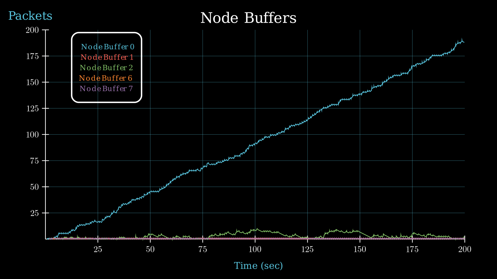
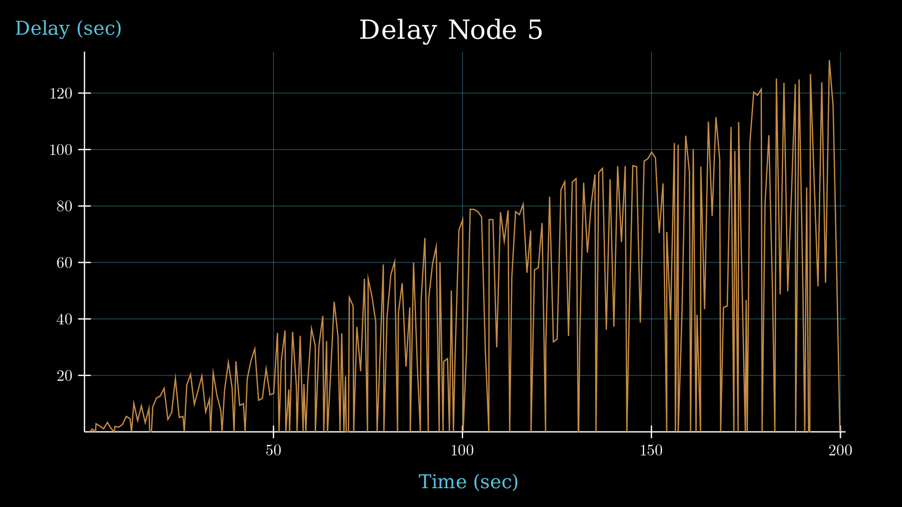
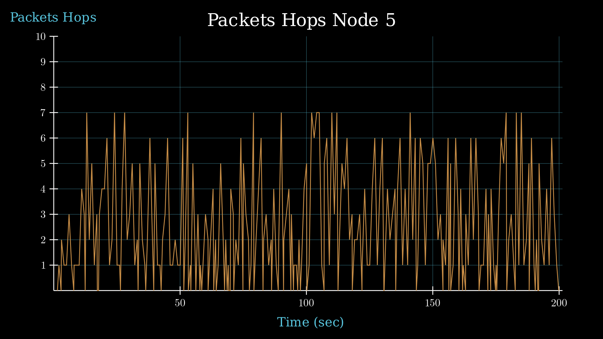

**FACULTAD DE MATEMATICA, ASTRONOMIA, FISICA Y COMPUTACION**  
**LIC. CIENCIAS DE LA COMPUTACION**  
**REDES Y SISTEMAS DISTRIBUIDOS**  

## Informe Laboratorio 4

# Analisis del tráfico de red bajo diferentes estrategias de enrutamiento en modelo de red de OMNeT++.

- Laboratorio desarrollado por el _Grupo 46_, conformado por:
  - ___Mensio Valentino___  
  - ___Longhi Fabrizio___ 
  - ___Espinosa Bruno___

## Resumen
Se realizó una comparación de dos estrategias de enrutamiento distintas mediante el análisis de dos casos específicos, tomando métricas como `Delay`,`Hops` y `Buffers`. Una estrategia es un más sencilla y la otra, implementada por nosotros, con una complejidad un poco mayor, que debería obtener mejores resultados dentro de un modelo de red en anillo generado mediante `OMNeT++`, en la cual también simulamos los distintos comportamientos de dichas estrategias.

## Introduccion
En el ámbito de redes, existen diversas topologías que son fundamentales en la configuración y eficiencia de las conexiones entre dispositivos, una de estas, es la topología de red de anillo`¹`. Una red en anillo, es una topología de red en la que cada nodo se conecta directamente y exactamente a otros dos nodos, formando una única ruta continua, para las señales a través de cada nodo, formando un círculo cerrado. Los datos viajan de un nodo a otro, y cada nodo maneja cada paquete`²`. Como mencionamos anteriormente, se usó `OMNeT++` para construir el modelo de red en anillo, que primeramente poseía una estrategia de enrutamiento sencilla, que con cada paquete que esta recibe es evaluado para determinar si el `nodo` local es el destino final del mismo. En caso de que lo sea, el paquete es enviado a la capa de aplicación local. En caso de que el paquete esté destinado a otro nodo se elige un interface para retransmitirlo. Esta re-transmisión y en general, el tráfico dentro del anillo es en sentido horario, hasta llegar a destino`³`. 

 

Con esta pequeña introducción, a continuación mostraremos el análisis que se realizó sobre la primera estrategia en dos casos diferentes:

### Caso 1 de estudio
Se corre el modelo con las fuentes de tráfico configuradas (`node[0]` y `node[2]` transmitiendo datos a `node[5]`).

| Node[5] | <!-- --> |
|---------|-------------------|
| Delay | Hop |
| ![Grafico de Delay_node[5] 1.1](Mediciones/TareaAnalisis/Part-1.1/Node5Delay_Part-1.1.png) AVG Delay: 51.16| ![Grafico de Hop_node[5] 1.1](Mediciones/TareaAnalisis/Part-1.1/Node5Hop_Part-1.1.png) AVG Hop: 3.9|

| Buffers |
|---------|
|  Recived Packages: 196|
 
#### Análisis de gráfico:
Vemos claramente, que dicho uso funciona de una forma ineficiente, ya que, no se toma las rutas más óptimas en ciertos momentos.

Esto se observa en la media de saltos realizada, que es 3.9. Esta media resulta de los saltos que realizan los paquetes generados en el `nodo [2]` (5 saltos) y el `nodo[0]` (3 saltos). Esto se puede mejorar, si el `nodo[2]` empieza a mandar sus paquetes en sentido antihorario, llegando así mucho más raído a su destino(`nodo[5]`). Debería realizar solo 3 saltos, obteniendo así una media de 3 saltos por paquete.

Por lo tanto, lo que está sucediendo es que hay parte de la red que no se está aprovechando.Además, podemos ver, que el buffer del `nodo[0]` está sufriendo congestion, ya que está almacenando los paquetes que le llega del `nodo[2]` y los que está creando el mismo, esto resulta en una media de delay muy alta 51.16 sec. Nuevamente si el `nodo[2]` siguiera un camino óptimo solucionaría los problemas de congestión al `nodo[0]`.

### Caso 2 de estudio 
Ahora, todos los nodos (0,1,2,3,4,6,7) generan tráfico hacia el `node[5]` con `packetByteSize` e `interArrivalTime` idénticos entre todos los nodos. Y después con distintos valores de `interArrivalTime`:

**Parte 2.1:** Valor del `interArrivalTime` = `1`  
**Parte 2.2:** Valor del `interArrivalTime` = `3`  
**Parte 2.3:** Valor del `interArrivalTime` = `5`  

Node 5 Delay | <!-- --> | <!-- --> |
|---------|-------------------|----------|
| Parte 2.1 | Parte 2.2 | Parte 2.3 |
|  AVG Delay: 36.38|  AVG Delay: 28.98|  AVG Delay: 25.55|

Node 5 Hop | <!-- --> | <!-- --> |
|---------|-------------------|----------|
| Parte 2.1 | Parte 2.2 | Parte 2.3 |
|  AVG Hop: 1|  AVG Hop: 2.39|  AVG Hop: 3|

Buffers | <!-- --> | <!-- --> |
|---------|-------------------|----------|
| Parte 2.1 | Parte 2.2 | Parte 2.3 |
|  Recived Packages: 381|  Recived Packages: 263|  Recived Packages: 237|

#### Analisis de grafico:
Analicemos los buffers de los nodos. Podemos ver que en todos los nodos a excepción del 4 van a congestionarse con el ` interArrivalTime = 1` esto se debe a que todos los nodos van a estar recibiendo datos de su vecino y a su vez están creando sus propios datos y almacenándolos. El nodo 4 solo crea sus datos por lo tanto la congestion no le afecta. A medida que vamos incrementando el `interArrivalTime` podemos ir viendo que hay menos nodos congestionados, esto se debe a que estamos creando paquetes más lento y transmitiéndolos a la misma velocidad que antes.

Con respecto al `delay` del nodo 5. Podemos ver que a medida que incrementemos el interArrivalTime, vamos a tener menos delay. Ya que estarías generando paquetes más lentos y eso ocasiona que no se produzca tanta congestion. 

Los `saltos(hop)` Podemos ver como para el primer caso `(2.1)` el `nodo[6]` rápidamente entrega una gran carga de paquetes ocasionando así que la media de datos sea de uno. 

Por el mismo fenómeno que ocasiono que el `delay` crezca, a medida que aumentamos su `interArrivalTime` los nodos cercanos al destino logran llegar antes al `nodo[6]` y entregar más paquetes de esos destinos, ocasionando así que la media de saltos aumente.

#### Explore y determine a partir de qué valor de interArrivalTime se puede garantizar un equilibrio o estabilidad en la red. Justifique.

- `interArrivalTime` es 1, logramos entregar una mayor cantidad de paquetes pero ocasionando una gran congestion.

- `interArrivalTime` es 3, logramos que los buffers se saturen más lentamente, pero entregamos una menor cantidad de paquetes por segundo.

- `interArrivalTime` es 5, logramos una saturación de la red sea mucho menor, pero desperdiciamos demasiada capacidad de la misma. 

Además que obtenemos una menor cantidad de paquetes por segundo. Por lo que la mejor opción se encuentra en aproximadamente en `interArrivalTime = 3`, ya que logramos una saturación de la red más lenta pero sin despreciar mucho la capacidad de la misma.

#### En conclusion 
El protocolo utilizado en Net es muy básico y no aprovecha eficientemente la estructura de la red.

## Cambio de estrategia
Modificamos el modelo de red dado para que tenga una estrategia de enrutamiento un poco más compleja y con posibilidad de mejora en las métricas. Esta basada en el protocolo de estado de enlace, este construyen tablas de enrutamiento basándose en una base de datos de la topologí­a.

Para que cada nodo descubra sus vecinos, se utiliza el envío de paquetes HELLO. Estos paquetes son enviados periódicamente por cada nodo a todos los nodos directamente conectados a él. Cuando un nodo recibe un paquete HELLO, responde con su propio paquete HELLO, confirmando así la existencia de una conexión bidireccional. 

Esta información se utiliza para construir la base de datos de estado de enlace, ya que permite a cada nodo conocer a sus vecinos directos y así empezar a intercambiar los LSPPakets que describen el estado de la red.

Una vez terminada de construir la tabla de enrutamiento se puede empezar a mandar los paquetes de datos y ver el comportamiento del tráfico.

### Descubrimiento de vecinos
Cada nodo envía paquetes de descubrimiento de vecinos `NeighborDiscoveryPacket` para identificar sus enlaces directos. 

#### NeighborDiscoveryPacket:
~~~
import packet;

packet NeighborDiscoveryPacket extends Packet{
    int LnkIndex;
    int neighborIndex;
}
~~~

#### Envio de paquetes de descubrimeinto:
~~~c++
void Net::askNeighborInfo()
{
    for (int i = 0; i < cntNeighbor; i++)
    {
        NeighborDiscoveryPacket *pkt = new NeighborDiscoveryPacket("NeighborDiscoveryPacket");
        pkt->setLnkIndex(i);
        pkt->setNeighborIndex(-1);
        send(pkt, "toLnk$o", i);
    }
}
~~~
#### Respuesta de paquete de descubiento:
~~~c++
void Net::actualizeNeighborInfo(NeighborDiscoveryPacket *pkt)
{
    int lnkIndex = pkt->getLnkIndex();
    int neighborIndex = pkt->getNeighborIndex();

    if (neighborReached < cntNeighbor)
    {
        neighborList.push_back(std::make_pair(lnkIndex, neighborIndex));
        neighborReached++;
        if (neighborReached ==  cntNeighbor)
        {
            sendLSP();
        }
    }
}
~~~

### Propagación  de Información
Cada nodo almacena esta información en `neighborList` y cuando el emisor recibe la respuesta de todos sus vecinos envía por inundación paquetes de estado de enlace`LSPPacket`.

#### LSPPacket:
~~~
import packet;

packet LSPPacket extends Packet {
    int node;
    int neighborList[];
}
~~~

#### Propagación del paquete
~~~c++
void Net::actualizeGraphRepresentation(LSPPacket *pkt)
{
    int source = pkt->getNode();
    std::vector<int> pktNeighbors;

    for (int i = 0; i < pkt->getNeighborListArraySize(); i++)
    {
        pktNeighbors.push_back(pkt->getNeighborList(i));
    }

    graph[source] = std::make_pair(pktNeighbors[0], pktNeighbors[1]);
    
    if (!LSPVis[source])
    {
        LSPVis[source] = true;
        cntLSPVis++;
        if (cntLSPVis == cntNodesGraph)
        {
            constructRoutingTable();
        }
        else
        {
            for (int i = 0; i < cntNeighbor; i++)
            {
                send(pkt->dup(), "toLnk$o", i);
            }
        }
    }
    else
    {
        delete pkt;
    }
}
~~~

### Actualización del Grafo de la Red
Como podemos ver, una vez que el nodo recibe todos los paquetes `LSPPacket` de todos los nodos crea una representación del grafo y aplicando el algoritmo BFS para determinar por cuál salida link debe salir el mensaje ´lnkToSend´.

#### Construccion de Tabla de Enrutamiento:
~~~c++
void Net::constructRoutingTable()
{
    lnkToSend.resize(cntNodesGraph, -1);
    std::queue<std::pair<int, int>> q;

    q.push(std::make_pair(graph[getParentModule()->getIndex()].first, 0));
    q.push(std::make_pair(graph[getParentModule()->getIndex()].second, 1));

    while (!q.empty())
    {
        std::pair<int, int> actNode = q.front();
        q.pop();

        int nodeIndex = actNode.first;
        int linkIndex = actNode.second;

        if (lnkToSend[nodeIndex] == -1)
        {
            lnkToSend[nodeIndex] = linkIndex;

            if (graph[nodeIndex].first != -1 && lnkToSend[graph[nodeIndex].first] == -1)
            {
                q.push(std::make_pair(graph[nodeIndex].first, linkIndex));
            }
            if (graph[nodeIndex].second != -1 && lnkToSend[graph[nodeIndex].second] == -1)
            {
                q.push(std::make_pair(graph[nodeIndex].second, linkIndex));
            }
        }
    }
}
~~~

### Reenvío de Paquetes
Los paquetes `cMessage` que llegan a un nodo son reenviados según la tabla de enrutamiento creada. `handleMessage` gestiona los mensajes entrantes y determina si son para el nodo local o si deben ser reenviados, para este último caso consulta la tabla `lnkToSend` y envía el paquete por el link más corto.

#### Gestión del mensaje
~~~c++
void Net::handleMessage(cMessage *msg)
{
    if (isNeighborInfo(msg))
    {
        NeighborDiscoveryPacket *pkt = check_and_cast<NeighborDiscoveryPacket *>(msg);
        if (pkt->getNeighborIndex() == -1)
        {
            pkt->setNeighborIndex(getParentModule()->getIndex());
            send(pkt, "toLnk$o", pkt->getLnkIndex() == 0 ? 1 : 0);
        }
        else
        {
            actualizeNeighborInfo(pkt);
            delete pkt;
        }
    }
    else if (isLSPInfo(msg))
    {
        LSPPacket *pkt = check_and_cast<LSPPacket *>(msg);
        actualizeGraphRepresentation(pkt);
    }
    else if (dynamic_cast<Packet *>(msg))
    {
        Packet *pkt = check_and_cast<Packet *>(msg);
        if (pkt->getDestination() == getParentModule()->getIndex())
        {
            send(pkt, "toApp$o");
        }
        else
        {
            int lnkToSendIndex = getLnkToSend(pkt->getDestination());
            if (lnkToSendIndex != -1)
            {
                send(pkt, "toLnk$o", lnkToSendIndex);
            }
            else
            {
                delete pkt;
            }
        }
    }
    else
    {
        delete msg;
    }
}
~~~

### Caso 1
Se corre el modelo con las fuentes de tráfico configuradas (`node[0]` y `node[2]` transmitiendo datos a `node[5]`).

| Node[5] | <!-- --> |
|---------|-------------------|
| Delay | Hop |
| ![Grafico de Delay_node[5] 3.1](Mediciones/TareaAnalisis/Part-3.1/Node5Delay_Part-3.1.png) AVG Delay: 6.9| ![Grafico de Hop_node[5] 1.1](Mediciones/TareaAnalisis/Part-3.1/Node5Hop_Part-3.1.png) AVG Hop: 3|

| Buffers |
|---------|
|  Recived Packages: 379 
Cada buffer pertenece a un link especifico del nodo siendo `link[0]` para los `nodos[1,0,7,6]` y `link[1]` para los `nodos[2,3,4]`.|

#### Analisis de grafico:

Aplicando el nuevo protocolo podemos ver claramente como el `Delay` es mucho menor comparado con la etapa anterior y como efectivamente el promedio de saltos es igual 3.

Esto se debe a que ahora el `nodo[2]` elige el camino más corto para llegar a su destino, disminuyendo en consecuencia la saturación ocurrida en el `nodo[0]` y disminuyendo el resto de métricas.

El resto de nodos solo tienen un pico de uso en sus buffers debido al protocolo de enrutamiento aplicado, luego se mantienen de forma constante enviando paquetes.

### Caso 2 de estudio:
Ahora, todos los `nodos[0,1,2,3,4,6,7]` generan tráfico hacia el `node[5]` con `packetByteSize` e `interArrivalTime = 3` idénticos entre todos los nodos.

| Node[5] | <!-- --> |
|---------|-------------------|
| Delay | Hop |
| ![Grafico de Delay_node[5] 3.1](Mediciones/TareaAnalisis/Part-3.2/Node5Delay_Part-3.2.png) AVG Delay: 15.7| ![Grafico de Hop_node[5] 1.1](Mediciones/TareaAnalisis/Part-3.2/Node5Hop_Part-3.2.png) AVG Hop: 1.87|

| Buffers |
|---------|
|  Recived Packages: 442
Aclarar que cada buffer pertenece a un link especifico del nodo siendo `link[0]` para los `nodos[1,0,7,6]` y `link[1]` para los `nodos[2,3,4]`.|

#### Analisis de grafico:

Utilizando el `interArrivalTime = 3` óptimo para la cantidad de nodos enviando información vemos nuevamente que si bien la cantidad promedio de saltos es menor que el caso anterior, no es por los mismos motivos.

En este caso los paquetes son recibidos por el `nodo[5]` por ambos lados, disminuyendo así la mayor cantidad de saltos que puede realizar un paquete (4 desde el `nodo[1]`), logrando así que la cantidad de saltos promedio disminuya, pero permitiendo que más paquetes lejanos lleguen al destino.

Esto lo podemos ver claramente en el `Delay` que disminuye considerablemente su tiempo promedio.

Por último vemos como los buffes de casi todos los nodos están vacíos menos el del `nodo[6]` que es el que más carga debe soportar (4 nodos).

Claramente la red no está siendo aprovechada al máximo y podríamos determinar un `interArrivalTime` un poco más bajo, permitiendo una cantidad de paquetes recibidos mayor sin saturar la red.

### Posibles mejoras

En nuestra implementación actual, utilizamos un método de inundación muy básico que no distingue el canal por el que llega el paquete. Esto resulta en que el paquete se reenvíe por el mismo canal por el que fue recibido. Posteriormente, el receptor elimina el paquete si ya lo ha procesado anteriormente, evitando así la creación de bucles.

Una posible mejora sería implementar una inundación selectiva. Este método permitiría recordar el canal por el cual llegó el paquete LSP (Link-State Packet) y reenviarlo únicamente a los vecinos restantes, excluyendo el canal de origen. Esto optimizaría la eficiencia de la red y reduciría el tráfico innecesario.

En nuestra implemetación al conocer la forma de nuestra red predefinimos la cantidad de nodos y vecinos de cada enrutador.

Podriamos mejorar el código para que funcione en cualquier red.

## Referencias
1_ https://medium.com/@trainingacademyitsqmet/el-sorprendente-secreto-detr%C3%A1s-de-la-topolog%C3%ADa-de-red-de-anillo-que-las-compa%C3%B1%C3%ADas-de-internet-no-c92025f987e5  
2_ https://es.wikipedia.org/wiki/Red_en_anillo  
3_ 2024 Lab4_enunciado https://famaf.aulavirtual.unc.edu.ar/mod/url/view.php?id=13569  
4_ https://aprenderedes.com/2019/07/enrutamiento-por-estado-de-enlace/  
